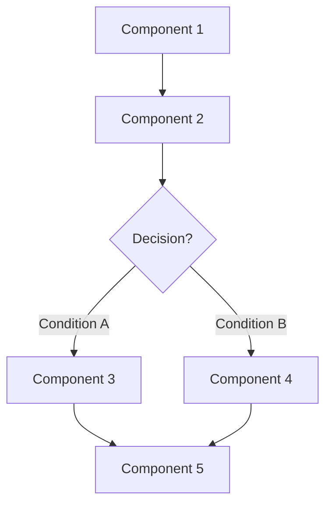
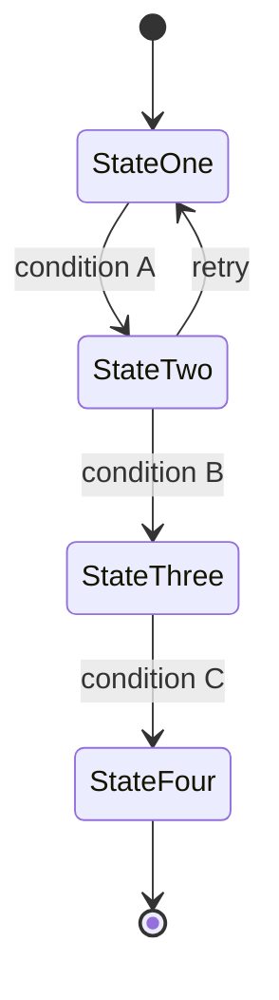

<!--
  Keep all eight headings, in this order, even when a section is short.
  Everything between the <!-- --> markers is guidance and does not render;
  delete or leave it, GitHub hides it either way. A missing section is worse
  than a thin one: the board and the burndown tooling read this shape.
-->

## What

<!--
  2-3 sentences, direct: what it is, what it does -- no reasoning yet.
  Cite our side as `path/to/file.ts:line` and, if this mirrors something
  elsewhere, a URL to it. State partial implementations honestly
  ("X exists but only does Y").
-->

## Why

<!--
  Problem -> Solution: the current pain point first, then the benefit.
  Name who is affected and what they see, lose, or cannot do. If you
  cannot name a user-visible consequence, do not file -- "it would be
  nicer" is not a consequence.
-->

## Prompt

<!--
  A self-contained implementation prompt someone (or an agent) could pick
  up cold, as ONE blockquote paragraph, in this exact order:
  ROLE (who/what plays this part) -> TASK (the exact job, one line)
  -> INPUT (what it receives) -> CONSTRAINTS (limits, retries, what not
  to do -- include the traps specific to this area: integer µUSD wherever
  money appears; the fleet-canary caveat wherever fleet metrics appear)
  -> OUTPUT (the exact format returned).
-->

> 

## Workflow

<!--
  Numbered steps -- the user/developer journey, in order. Each step a
  reviewable unit.
-->

1. 
2. 
3. 
4. 
5. 

## Loop

<!--
  Two parts: (1) the verification loop -- how to check it works, the
  definition of done, and what to re-check afterwards (docs, gates,
  neighbouring behaviour); an issue is closed with a file/test citation,
  only when every point here is genuinely met. (2) the feedback cycle --
  how data is collected, how it improves the feature, how it repeats.
  Write "Not applicable" if this feature has no self-improving loop.
-->

## Graph

<!--
  Mermaid graph TD of the affected components and connections -- any
  number of components, what talks to what, where the change lands.
  Keep the fence; GitHub renders it.
-->

## Layout

<!--
  UI panels, buttons, dashboards -- what the user sees and clicks, as a
  plain visual description (ASCII wireframe is fine). If there is no UI
  surface, write exactly "No UI surface." and keep the heading.
-->

## Flow

<!--
  Mermaid stateDiagram-v2 of the states and transitions -- any number of
  states, INCLUDING the failure/retry branches: what the user sees when
  it does not work.
-->

<!--
  TRAILER -- the last line of the body, exactly this shape. The board's
  Severity/Effort fields are transcribed from it verbatim, so keep the
  spelling and the middle dot (·).

  Severity, by technical blast radius, independent of schedule:
    critical  money loss, credential compromise, or data loss with no compensating control
    high      exploitable, or a live correctness/availability failure on a public surface
    medium    real defect or gap, bounded blast radius or a workaround exists
    low       defence-in-depth, hygiene, polish
  Effort:  S (hours) · M (a day or two) · L (multi-day, or needs a design first)

  Priority is derived from Severity × how live the surface is -- never
  written here. If a phase:* or area:* label applies, add it after filing.
-->

Severity: medium · Effort: M
