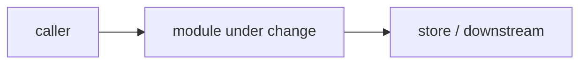
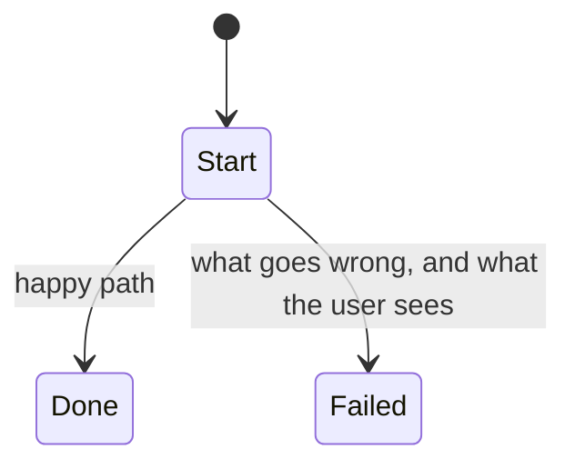

<!--
  Keep all eight headings, in this order, even when a section is short.
  Everything between the <!-- --> markers is guidance and does not render;
  delete or leave it, GitHub hides it either way. A missing section is worse
  than a thin one: the board and the burndown tooling read this shape.
-->

## What

<!--
  The gap or defect, concretely. Cite our side as `path/to/file.ts:line`
  and, if this mirrors something elsewhere, a URL to it. State partial
  implementations honestly ("X exists but only does Y").
-->

## Why

<!--
  The user-visible consequence. If you cannot name one, do not file --
  "it would be nicer" is not a consequence. Name who is affected and what
  they see, lose, or cannot do.
-->

## Prompt

<!--
  A self-contained implementation prompt someone (or an agent) could pick
  up cold, as a blockquote. Include the traps specific to this area
  (integer µUSD wherever money appears; the fleet-canary caveat wherever
  fleet metrics appear; anything a newcomer would get wrong).
-->

> 

## Workflow

<!-- Ordered steps to implement it. Numbered. Each step a reviewable unit. -->

1. 

## Loop

<!--
  The verification loop: how to check it works, the definition of done,
  and what to re-check afterwards (docs, gates, neighbouring behaviour).
  An issue is closed with a file/test citation, only when every point here
  is genuinely met.
-->

## Graph

<!--
  Mermaid diagram of the affected modules or data path -- what talks to
  what, where the change lands. Keep the fence; GitHub renders it.
-->

## Layout

<!--
  Wireframe (ASCII is fine) of any UI surface this touches. If there is
  none, write exactly "No UI surface." and keep the heading.
-->

## Flow

<!--
  Mermaid diagram of the user journey or state transitions, INCLUDING the
  failure branches -- what the user sees when it does not work.
-->

<!--
  TRAILER -- the last line of the body, exactly this shape. The board's
  Severity/Effort fields are transcribed from it verbatim, so keep the
  spelling and the middle dot (·).

  Severity, by technical blast radius, independent of schedule:
    critical  money loss, credential compromise, or data loss with no compensating control
    high      exploitable, or a live correctness/availability failure on a public surface
    medium    real defect or gap, bounded blast radius or a workaround exists
    low       defence-in-depth, hygiene, polish
  Effort:  S (hours) · M (a day or two) · L (multi-day, or needs a design first)

  Priority is derived from Severity × how live the surface is -- never
  written here. If a phase:* or area:* label applies, add it after filing.
-->

Severity: medium · Effort: M
