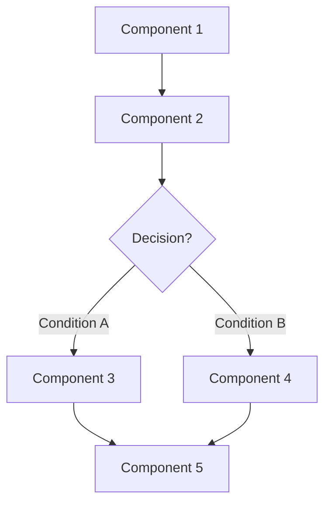
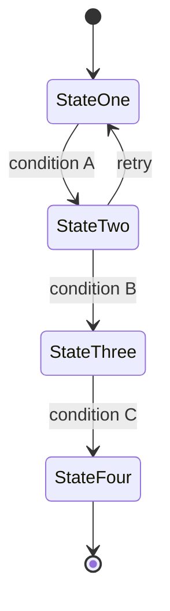

# Feature Issue Template

Standard 8-Section Format for Writing Feature Issues

This document defines a fixed structure — What / Why / Prompt / Workflow / Loop / Graph / Layout / Flow, plus Severity and Effort — for specifying any feature before development begins. Using the same structure every time keeps issues consistent, reviewable, and directly actionable by a developer or an AI coding assistant.

## 1. Section Guide — What Each Section Contains, and How to Write It

| Section | How to write it | Why it matters |
|---------|---------------|----------------|
| **What** | 2-3 sentences, direct — what it is, what it does. | Reader understands immediately |
| **Why** | Problem → Solution: current pain point, then the benefit. | Value proposition is clear |
| **Prompt** | One paragraph, in this exact order: ROLE → TASK → INPUT → CONSTRAINTS → OUTPUT | Implementation guidance |
| **Workflow** | Numbered steps — the user/developer journey, in order. | Technical clarity |
| **Loop** | The feedback cycle — how data is collected, improves the feature, and repeats. | Long-term viability |
| **Graph** | Mermaid graph TD — any number of system components & connections. | Visual architecture |
| **Layout** | UI panels, buttons, dashboards — plain visual description. | Design reference |
| **Flow** | Mermaid stateDiagram-v2 — any number of states & transitions. | Runtime behavior |
| **Severity · Effort** | Priority + implementation cost, realistic assessment. | For triage |

## 2. Blank Template — Copy This For Every New Feature

Feature Title: [Feature name]

What
[2-3 sentences. What the feature does — plain description, no reasoning.]

Why
[Pain point first, then the feature's benefit. What problem does this solve?]

Prompt
[From an AI/ML perspective: what input does the model get, what process runs, what output comes back.]

[Formula reminder — write as ONE paragraph: ROLE (who/what plays this part) → TASK (the exact job, one line) → INPUT (what it receives) → CONSTRAINTS (limits, retries, what not to do) → OUTPUT (exact format returned).]

Workflow
[Numbered steps — the user or developer journey, in order.]
1. 
2. 
3. 
4. 
5. 

Loop
[The feedback cycle: how data is collected, how it improves the feature, how it repeats. Write 'Not applicable' if this feature has no self-improving loop.]

Graph

Layout
[UI panels, buttons, dashboards — what the user sees and clicks. Plain visual description.]

Flow

Severity · Effort
Severity: [Low / Medium / High]  ·  Effort: [S / M / L]
